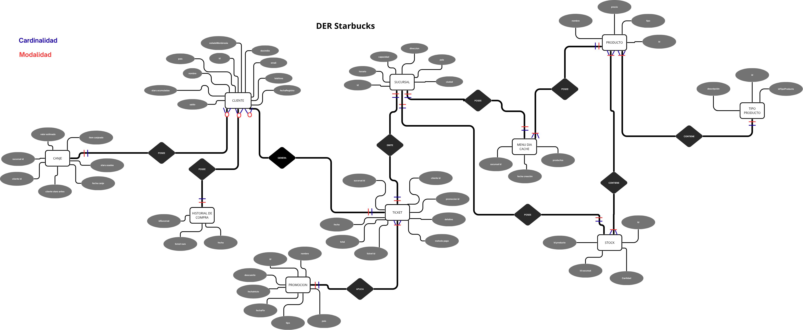
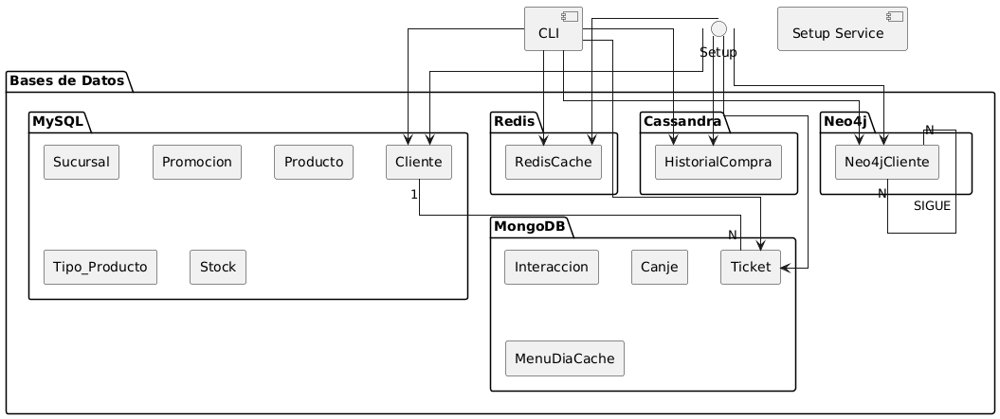

# ☕ TP Ingeniería de Datos II: Starbucks Políglota

## 📝 Descripción del Proyecto

Este proyecto implementa una arquitectura de datos políglota para simular los sistemas de información de una cadena de cafeterías (Starbucks). El objetivo es utilizar la base de datos más adecuada para cada tipo de dato y necesidad de negocio, incluyendo gestión de catálogos, transacciones, datos de fidelización y análisis relacional.

El *setup* completo se orquesta mediante **Docker Compose**, y se incluye una **Interfaz de Usuario de Texto (TUI)** para demostrar la funcionalidad de las consultas en cada motor de base de datos.

## DER de la applicacion:


## 🚀 Arquitectura Políglota (Servicios)

| Servicio | Tecnología | Propósito |
| :--- | :--- | :--- |
| **`mysql`** | MySQL | **Maestro/Relacional:** Gestión de catálogos (`Producto`, `Sucursal`, `Cliente`) y datos de fidelización. |
| **`mongodb`** | MongoDB | **Transaccional/Documental:** Almacenamiento de órdenes de compra y transacciones históricas detalladas. |
| **`cassandra`** | Apache Cassandra | **Analítica/Series de Tiempo:** Registro de historial de compras (`HistorialCompra`) y logs de sistema. |
| **`neo4j`** | Neo4j | **Grafos:** Análisis de relaciones complejas (ej. "Productos más conectados" o "Clientes que compraron productos recomendados por otros clientes"). |
| **`redis`** | Redis | **Cache:** Almacenamiento volátil para la sesión del usuario o *cache* de menús. |
| **`cli`** | Python (Rich) | **Interfaz TUI:** Herramienta para ejecutar y demostrar las *queries* de negocio en cada BD. |
| **`setup_service`** | Bash/Python/Shells de BD | **Inicialización:** Script que espera por la disponibilidad de todas las BD e inyecta los datos iniciales y la estructura. |
| **`seed_service`**| Python (FastAPI) | **Generador de Datos:** Servicio que genera datos de prueba (órdenes, clientes, etc.) bajo demanda a través de una API. |



## 📦 Estructura del Proyecto

```
.
├── .gitignore                  # Archivo para ignorar archivos y directorios en Git.
├── Arquitectura.png            # Diagrama de la arquitectura políglota.
├── casos_de_uso.txt            # Documento que detalla los requisitos y casos de uso.
├── cli/                        # Entorno y código de la Interfaz TUI (Terminal User Interface).
│   ├── cli_v2.py               # Lógica principal de la TUI, con navegación por directorios.
│   ├── cli_v3.py               # Script alternativo que inicia la TUI y un generador de datos en segundo plano.
│   ├── Dockerfile              # Define la imagen para el servicio CLI.
│   └── queries/                # Carpeta vacía utilizada como punto de montaje en Docker.
├── DER_Definitivo.png          # Diagrama Entidad-Relación (DER) definitivo.
├── DER.puml                    # Archivo fuente PlantUML para el DER.
├── docker-compose.yml          # Definición y orquestación de todos los servicios con Docker Compose.
├── queries/                    # Contenedor principal de scripts y consultas, organizadas por caso de uso y tecnología.
│   ├── Auxiliares(no ejecutar directamente)/ 
│   │   ├── consulta_tickets_cliente.js # Script JS de MongoDB, usado por la lógica Python.
│   │   └── mongo_query_top5.js         # Script JS de MongoDB, usado para el cálculo del Top 5.
│   ├── Casos_de_Uso/                   # Directorio para scripts de casos de uso específicos.
│   │   ├── bebidas_precio_mas5.sql     # Consulta SQL para encontrar bebidas con precio mayor a 5.
│   │   ├── canje_cliente_fecha.py      # Script Políglota: Consulta canjes de un cliente en MongoDB y busca sus detalles en MySQL.
│   │   ├── clientes_por_tipo_producto.cypher # Consulta Neo4j: Clientes que compraron >=3 tipos de productos.
│   │   ├── menu_del_dia_cache.py       # Script Python: Demuestra el uso de Redis para cache de menú del día.
│   │   ├── ordenes_fecha_sucursal.py   # Script Políglota: Consulta órdenes en Cassandra y las cruza con tickets en MongoDB.
│   │   ├── pedidos_cliente_septiembre.py # Script Políglota: Consulta tickets de un cliente en Septiembre (MongoDB), validando cliente en MySQL.
│   │   ├── productos_mas_conectados.cypher # Consulta Neo4j: Productos comprados por más clientes.
│   │   ├── ranking_clientes_stars.sql  # Consulta SQL: Ranking de clientes por puntos de lealtad.
│   │   └── top_5_prods.py              # Script Políglota: Coordina MySQL (Sucursales) y MongoDB (Ventas).
│   ├── Practica_Examen/                # Directorio para agrupar consultas de escenarios de evaluación.
│   │   ├── AllSalesSucursal.js
│   │   ├── AllTickets.js
│   │   └── DropDocument.js
│   └── Pruebas/                        # Scripts para verificar la conexión y el estado de cada base de datos.
│       ├── promociones_activas_hoy.sql
│       ├── prueba_cassandra.cql
│       ├── prueba_mongodb.js
│       ├── prueba_mysql.sql
│       ├── prueba_neo4j.cypher
│       └── prueba_redis.py
├── README.md                   # Documentación principal del proyecto.
├── seed_service/               # Servicio para generar datos de prueba.
│   ├── app.py                  # Lógica del servicio FastAPI.
│   ├── Dockerfile              # Define la imagen para el servicio de seed.
│   └── requirements.txt        # Dependencias de Python para el servicio.
└── setup/                      # Lógica para la inicialización y carga de datos de las DBs.
    ├── 01_mysql_init.sql
    ├── 02_mongodb_init.js
    ├── 03_cassandra_init.cql
    ├── 04_neo4j_init.cypher
    ├── 05_redis_config.conf
    ├── Dockerfile
    ├── init_all_dbs.sh
    └── wait-for-it.sh
```

## ⚙️ Configuración y Ejecución

### Requisitos

  * Docker (v20.10.0+)
  * Docker Compose (v2.0.0+)

### Pasos de Ejecución

1.  **Construir y Lanzar los Contenedores:**
    Este comando construye la imagen `cli` y levanta todos los servicios, incluido el `setup_service` que inicializará las bases de datos.

    ```bash
    docker compose up --build
    ```

2.  **Verificar el Estado:**
    Asegúrate de que todos los servicios estén en estado `Up` o `Exited (0)` (en el caso de `setup_service`):

    ```bash
    docker compose ps
    ```

3.  **Iniciar la TUI (Interfaz de Consulta):**
    Una vez que las bases de datos estén inicializadas, puedes iniciar la interfaz para ejecutar las *queries*.

    *   **Opción A (Estándar):**
        Inicia la TUI estándar para ejecutar consultas manualmente.
        ```bash
        docker compose exec cli python cli_v2.py
        ```

    *   **Opción B (Con Generador de Datos):**
        Inicia la TUI y, en segundo plano, un generador automático de transacciones para simular un entorno dinámico.
        ```bash
        docker compose exec cli python cli_v3.py
        ```

    *Dentro de la TUI, puedes navegar por los directorios para encontrar el script que deseas ejecutar. Simplemente escribe el ID del script o directorio para seleccionarlo.*

4.  **Detener y Limpiar:**
    Para detener todos los servicios y eliminar los contenedores y volúmenes (si usaste `-v` en `down`), usa:

    ```bash
    docker compose down -v
    ```
5. **Conectar a un servicio:**
    Para conectarte a la terminal de un servicio en particular (por ejemplo, `mysql`):
    ```bash
    docker compose exec mysql bash
    ```

## 🔑 Credenciales (Configuración por Defecto)

| Servicio | Host (Interno) | Usuario | Contraseña | Base de Datos (Inicial) | Puerto (Local) |
| :--- | :--- | :--- | :--- | :--- | :--- |
| **MySQL** | `mysql` | `root` | `root_password` | `my_data_warehouse` | `3306` |
| **MongoDB** | `mongodb` | `rootuser` | `rootpassword` | `starbucks_transactions` | `27017` |
| **Cassandra** | `cassandra` | (N/A) | (N/A) | `starbucks_analytics` | `9042` |
| **Neo4j** | `neo4j` | `neo4j` | `neo4jpassword` | `neo4j` | `7687` |
| **Redis** | `redis` | (N/A) | (N/A) | (N/A) | `6379` |