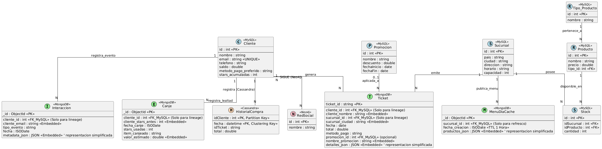

# ☕ TP Ingeniería de Datos II: Starbucks Políglota

## 📝 Descripción del Proyecto

Este proyecto implementa una arquitectura de datos políglota para simular los sistemas de información de una cadena de cafeterías (Starbucks). El objetivo es utilizar la base de datos más adecuada para cada tipo de dato y necesidad de negocio, incluyendo gestión de catálogos, transacciones, datos de fidelización y análisis relacional.

El *setup* completo se orquesta mediante **Docker Compose**, y se incluye una **Interfaz de Usuario de Texto (TUI)** para demostrar la funcionalidad de las consultas en cada motor de base de datos.

## DER de la applicacion:


## 🚀 Arquitectura Políglota (Servicios)

| Servicio | Tecnología | Propósito |
| :--- | :--- | :--- |
| **`mysql`** | MySQL/MariaDB | **Maestro/Relacional:** Gestión de catálogos (`Producto`, `Sucursal`, `Cliente`) y datos de fidelización. |
| **`mongodb`** | MongoDB | **Transaccional/Documental:** Almacenamiento de órdenes de compra y transacciones históricas detalladas. |
| **`cassandra`** | Apache Cassandra | **Analítica/Series de Tiempo:** Registro de eventos de canje de puntos y logs de sistema. |
| **`neo4j`** | Neo4j | **Grafos:** Análisis de relaciones complejas (ej. "Clientes que compraron productos recomendados por otros clientes"). |
| **`redis`** | Redis | **Cache:** Almacenamiento volátil para la sesión del usuario o *cache* de menús. |
| **`cli`** | Python (Rich) | **Interfaz TUI:** Herramienta para ejecutar y demostrar las *queries* de negocio en cada BD. |
| **`setup_service`** | Bash/Python/Shells de BD | **Inicialización:** Script que espera por la disponibilidad de todas las BD e inyecta los datos iniciales y la estructura. |

## 📦 Estructura del Proyecto

```
# Estructura del Repositorio

Este repositorio contiene la arquitectura de un proyecto políglota, utilizando diferentes tecnologías de base de datos (MySQL, MongoDB, Cassandra, Neo4j, Redis) y una Interfaz de Línea de Comandos (CLI) desarrollada en Python.

## 🗂️ Árbol de Directorios

El árbol de directorios refleja una estructura más organizada, separando las consultas de soporte de las principales, e introduciendo la navegación por carpetas en la CLI.

| Ruta | Descripción |
| :--- | :--- |
| **TP/** | **Directorio raíz del proyecto.** |
| ├── `casos_de_uso.txt` | Documento de texto que detalla los requisitos o casos de uso implementados y/o planificados para el proyecto. |
| **├── cli/** | Contiene los archivos para el servicio de **Interfaz de Línea de Comandos (TUI)**. |
| │   ├── `cli_v2.py` | **Nueva Lógica Principal de la TUI.** Implementa la navegación por directorios para organizar las consultas. |
| │   ├── `Dockerfile` | Define la imagen de Docker para el entorno CLI. |
| │   └── `queries` | **Carpeta vacía.** Se usa como punto de montaje para sincronizar las consultas del host, aunque la CLI apunta a `/app/queries` (la carpeta principal). |
| **├── DER.png** | Diagrama Entidad-Relación (DER) del esquema relacional. |
| **├── DER.puml** | Archivo fuente en PlantUML para la generación del DER. |
| **├── docker-compose.yml** | Archivo de orquestación de Docker que define y conecta todos los servicios de la arquitectura políglota. |
| **├── queries/** | **Contenedor principal de scripts y consultas.** Ahora estructurado con subcarpetas para mejor organización. |
| │   ├── **Auxiliares(no ejecutar directamente)** | Scripts de base de datos que están diseñados para ser **inyectados o llamados por scripts Python** (lógica políglota), no directamente por el usuario. |
| │   │   ├── `consulta_tickets_cliente.js` | Script de MongoDB que consulta tickets, utilizado por `pedidos_cliente_septiembre.py`. |
| │   │   └── `mongo_query_top5.js` | Script de MongoDB que calcula el Top 5 de productos vendidos, utilizado por `top_5_prods.py`. |
| │   ├── `bebidas_precio_mas5.sql` | Consulta SQL (ejemplo de consulta directa) |
| │   ├── **`pedidos_cliente_septiembre.py`** | Script de lógica políglota que pide un `clienteId` y consulta sus transacciones de Septiembre en MongoDB. |
| │   ├── **`Practica Examen`** | Directorio para consultas preparadas para escenarios de evaluación o prueba. |
| │   ├── `promociones_activas_hoy.sql` | Consulta SQL (ejemplo de consulta directa) |
| │   ├── **`Pruebas`** | Directorio para scripts de prueba básicos en cada base de datos. |
| │   │   ├── `prueba_cassandra.cql` | Script de prueba para Cassandra. |
| │   │   ├── `prueba_mongodb.js` | Script de prueba para MongoDB. |
| │   │   ├── `prueba_mysql.sql` | Script de prueba para MySQL. |
| │   │   └── `prueba_neo4j.cypher` | Script de prueba para Neo4j. |
| │   ├── `ranking_clientes_stars.sql` | Consulta SQL para obtener el ranking de clientes con más *Stars* acumuladas (requiere el campo agregado en la tabla `Cliente`). |
| │   └── **`top_5_prods.py`** | Script de lógica políglota: coordina MySQL (Sucursales) y MongoDB (Ventas). |
| **├── README.md** | Documentación principal del proyecto. |
| **└── setup/** | Lógica y scripts para la **inicialización y carga de datos** de las bases de datos. |
|    ├── `01_mysql_init.sql` | Inicialización de MySQL. |
|    ├── `02_mongodb_init.js` | Inicialización de MongoDB. |
|    ├── `03_cassandra_init.cql` | Inicialización de Cassandra. |
|    ├── `04_neo4j_init.cypher` | Inicialización de Neo4j. |
|    ├── `05_redis_config.conf` | Archivo de configuración para Redis. |
|    ├── `Dockerfile` | Dockerfile para el servicio de `setup`. |
|    ├── `init_all_dbs.sh` | Script maestro de inicialización. |
|    └── `wait-for-it.sh` | Script auxiliar para esperar la disponibilidad de los servicios. |
```

## ⚙️ Configuración y Ejecución

### Requisitos

  * Docker (v20.10.0+)
  * Docker Compose (v2.0.0+)

### Pasos de Ejecución

1.  **Construir y Lanzar los Contenedores:**
    Este comando construye la imagen `cli` y levanta todos los servicios, incluido el `setup_service` que inicializará las bases de datos.

    ```bash
    docker compose up --build
    ```

2.  **Verificar el Estado:**
    Asegúrate de que todos los servicios estén en estado `Up` o `Exited (0)` (en el caso de `setup_service`):

    ```bash
    docker compose ps
    ```

3.  **Iniciar la TUI (Interfaz de Consulta):**
    Una vez que las bases de datos estén inicializadas, puedes iniciar la interfaz para ejecutar las *queries*.

    ```bash
    docker compose exec cli python cli_v2.py
    ```

    *Dentro de la TUI, selecciona el ID del script que deseas ejecutar y presiona Enter.*

4.  **Detener y Limpiar:**
    Para detener todos los servicios y eliminar los contenedores y volúmenes (si usaste `-v` en `down`), usa:

    ```bash
    docker compose down -v
    ```
5. **Conectar al servicio:**
    Para conectarte con algun servicio en particular.
    ```bash
    docker exec -it 84c107aef385 bash
    ```

## 🔑 Credenciales (Configuración por Defecto)

| Servicio | Host (Interno) | Usuario | Contraseña | Base de Datos (Inicial) | Puerto (Local) |
| :--- | :--- | :--- | :--- | :--- | :--- |
| **MySQL** | `mysql` | `root` | `root_password` | `my_data_warehouse` | `3306` |
| **MongoDB** | `mongodb` | `rootuser` | `rootpassword` | `starbucks_transactions` | `27017` |
| **Cassandra** | `cassandra` | (N/A) | (N/A) | `keyspace_starbucks` | `9042` |
| **Neo4j** | `neo4j` | `neo4j` | `neo4jpass` | `neo4j` | `7687` |
| **Redis** | `redis` | (N/A) | (N/A) | (N/A) | `6379` |